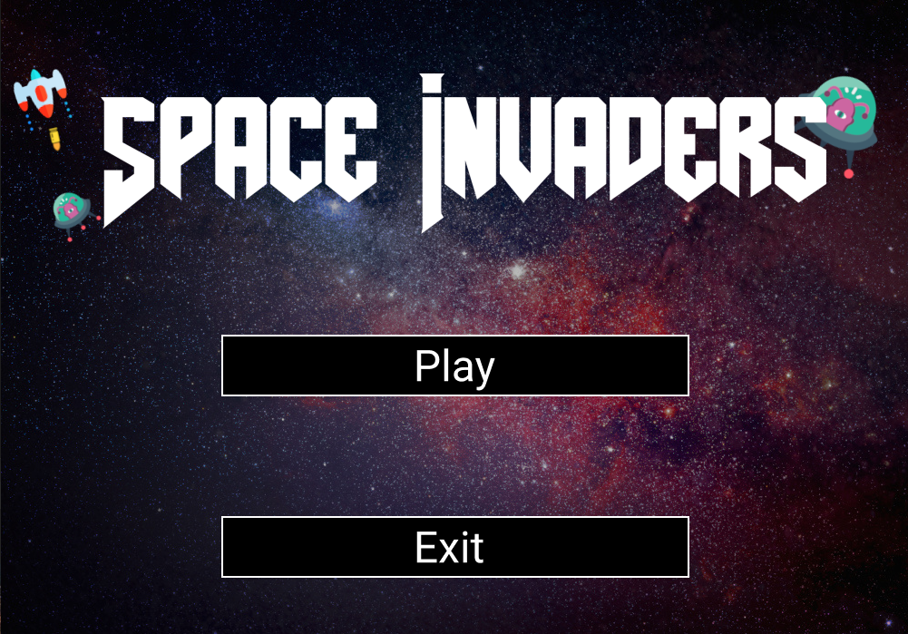
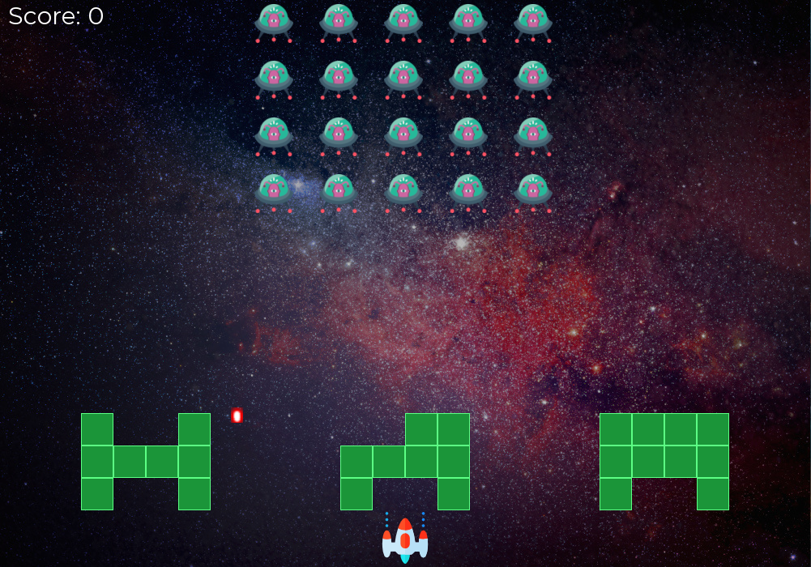

# Space Invader

This is well known game from 70's called Space Invaders.
It is written in C with CSFML library.Rules are the same as the in the original game.
At the end of the level game displays score which the player got. Destroying one ufo ship is worth 1 point. 
## **Menu Snapshot**

## **Gameplay snapshot**

    